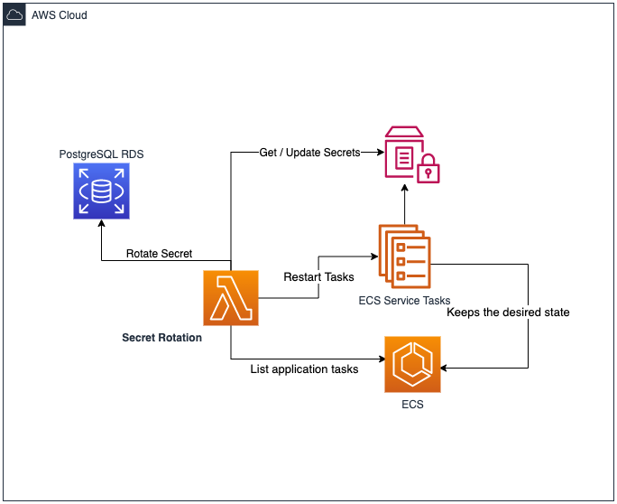

# Secrets Rotation

Path: functions/rotate-secrets/\*

1. The Lambda function connects to the RDS using the current secret.
2. Generates a 32 characters random password including ascii_letters, digits and 4. punctuation (excluding “:/@“\’\\“) as those are separators characters.
3. If connected, rotates the secret in the RDS
4. Test new secret before update application SSM parameters
5. If Success updates build the DATABASE_URL parameter and RDS Secret.
6. Then restart application containers on ECS to refresh secret

